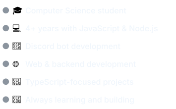

  

  

<h1 align="center">👋 Hi, I'm Tumonulo</h1>

  A developer passionate about technology, clean code, and continuous learning. 
  I love exploring new tools and building useful solutions.

  
  

<h2 align="center">👨‍💻 About Me</h2>

  
  

<h2 align="center">🛠️ Stack</h2>

  

<h2 align="center">📊 GitHub</h2>

  
  

<h2 align="center">📫 Contact</h2>

  <a href="mailto:tumonulo.dev@gmail.com">tumonulo.dev@gmail.com</a>
  ·
  <a href="https://discord.gg/8nu3ZdDkp7">TS Community Brawl</a>

