  

  

# 👋 Hi, I'm tumonulo

  Desarrollador apasionado por la tecnología, el código limpio y el aprendizaje constante. 
  Me encanta explorar nuevas herramientas y construir soluciones útiles.

  
  

## 👨‍💻 About Me

| | |
|:---|:---|
| **🎓 Computer Science student**  **💻 4+ years with JavaScript & Node.js**  **🤖 Discord bot development**  **🌐 Web & backend development**  **🧠 TypeScript-focused projects**  **🚀 Always learning and building** | 

 |

## 🛠️ Stack

  

## 📊 GitHub

  
  

## 📫 Contact

  <a href="mailto:tumonulo.dev@gmail.com">tumonulo.dev@gmail.com</a>
  ·
  <a href="https://discord.gg/8nu3ZdDkp7">TS Community Brawl</a>

